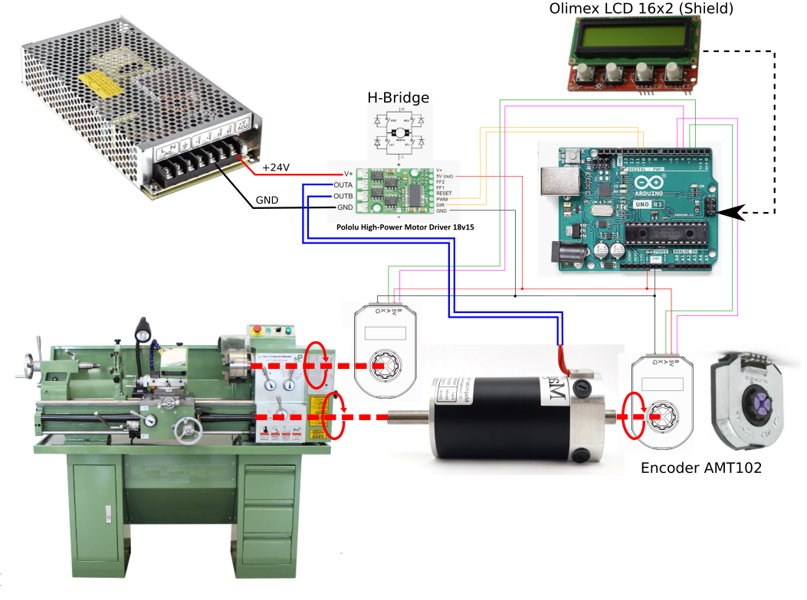
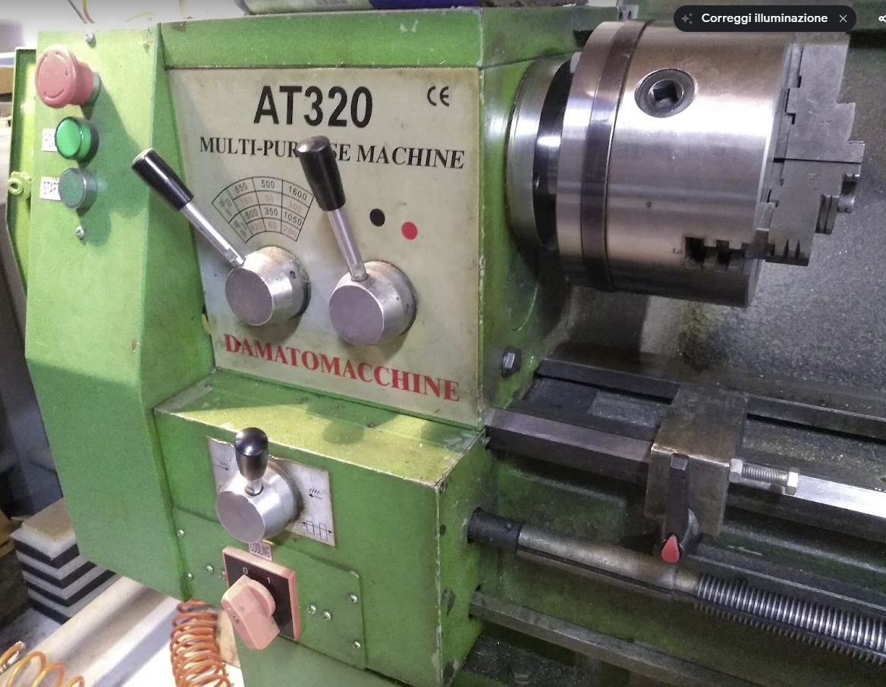
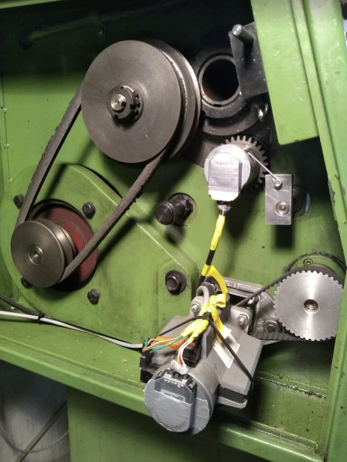
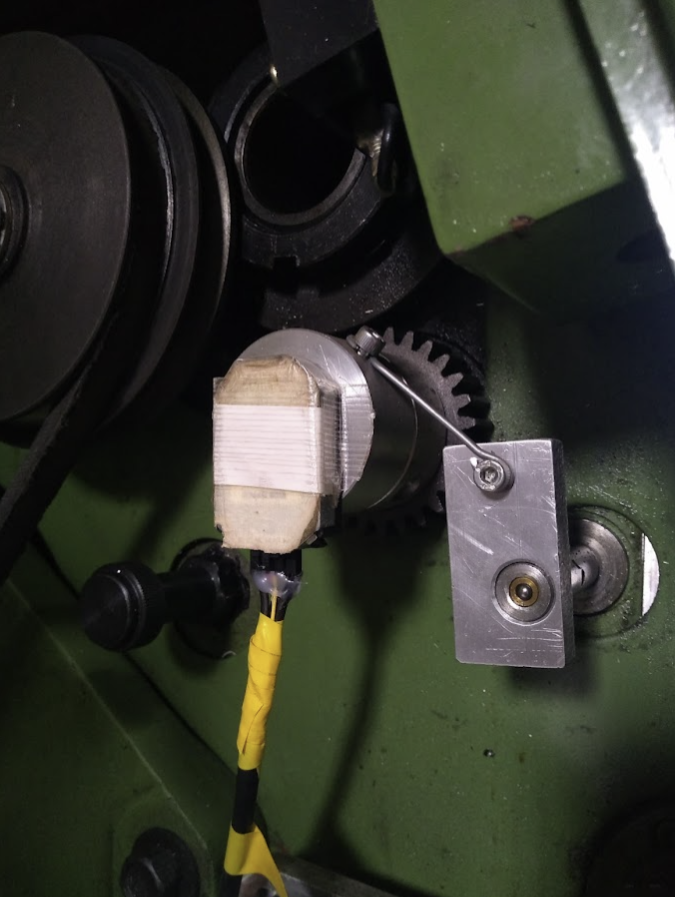
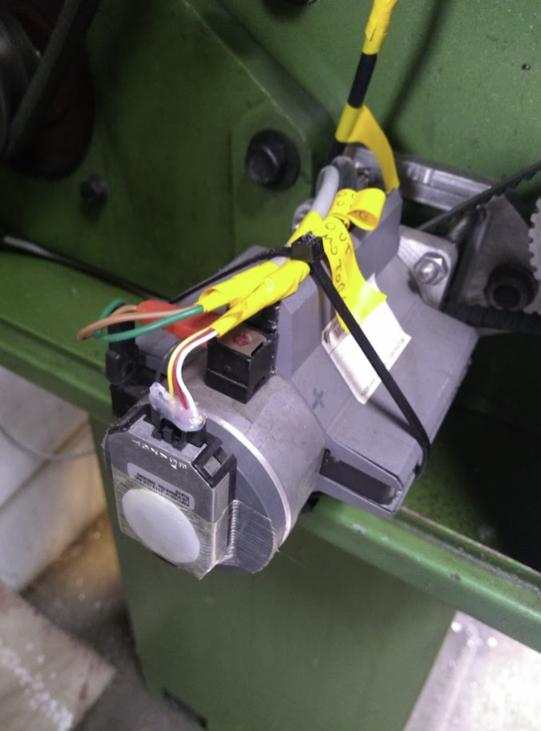

# ArduinoELS
Arduino UNO based ELS (Electronic Lead Screw) controller for semi-CNC lathes

# VIDEO
[ArduinoELS video 1](https://www.youtube.com/watch?v=R2N3Vt5ZQ9w)  
[ArduinoELS video 2](https://www.youtube.com/watch?v=t7haTgEgzCQ)

# BOM
* 1 x Arduino UNO
* 1 x LCD 16x2 [Olimex](https://www.olimex.com/Products/Duino/Shields/SHIELD-LCD16x2/open-source-hardware) , [Mouser](https://www.mouser.it/ProductDetail/Olimex-Ltd/SHIELD-LCD-16X2?qs=J7x7253A5u648zrOBSewkA%3D%3D&gclid=Cj0KCQiAsoycBhC6ARIsAPPbeLu_jEffOB8IIknJeQpOPuHdUPCckwJhTo6h2fUdIXRL54KXZMR5NxMaAvVOEALw_wcB)
* 1 x Pololu H-Bridge, ex. 18v15 or similar with PWM/DIR mode supported [Pololu 18v15](https://www.pololu.com/product/755)
* 2 x Encoder [AMT102](https://www.digikey.it/it/products/detail/cui-devices/AMT102-V/827015)
* 1 x Brushed DC motor
* 1 x DC power supply

# HARDWARE SETTINGS

## Connections
* GPIO (2, 4) --> Quadrature encoder (lathe spindle) input (A, B)
* GPIO (3, 5) --> Quadrature encoder (servo motor tool feeder) input (A, B)
* GPIO (10, 11) --> H-Bridge (DIR, PWM)
* GPIO (0[RXD], 1[TXD], A4[SDA], A5[SCL]) --> LCD Olimex 16x2 (Shield)
* 5 Volt output from H-Bridge BEC to --> Arduino UNO and encoders supply lines
* GND is common to all boards
* H-Bridge outputs (A, B) --> Servo motor power lines 

# Encoders settings
* AMT102 Encoders resolution can be set changing deep switch, take a look at the  [AMT102-V-datasheet.pdf](web/AMT102-V-datasheet.pdf)
* My lathe encoder is set to 512 ppr and is readden by encoder library in 4x mode, giving a total of 2048 step per revolution of the encoder. The ratio between the encoder and the spindle is 1/1 so for every spindle turn I have 2048 steps.
* The encoder mounted on the servomotor shaft is set to 256 ppr, and is readden in 4x mode by library producing 1024 step per motor revolution. The ratio between the motor and the lead screw of the lathe is 4.2/1, so for every lead screw turn I have 1024*4.2 = 4300.8 steps.
* The distance the tool moves for every lead screw turn is in my machine exactly 1.04 mm, measured using a digital caliper.
Theese three parameters are listed on lines 24-26 of ArduinoELS.ino file, and must be changed according to your machine settings.

# MECHANICAL ASSEMBLY

# TODO
* Translate all my variable names and comments from Italian to English...

# LICENSE
[GPL3](LICENSE.md)

